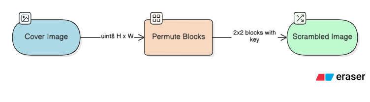
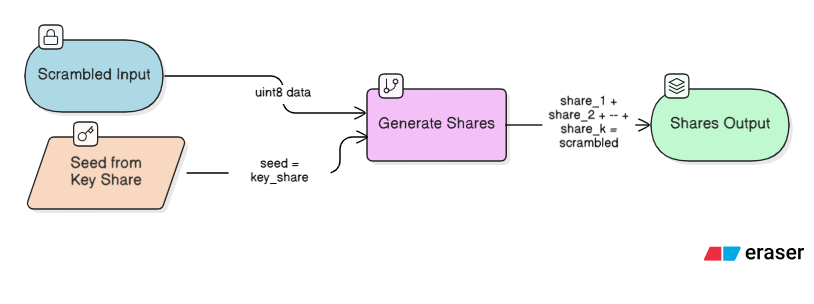
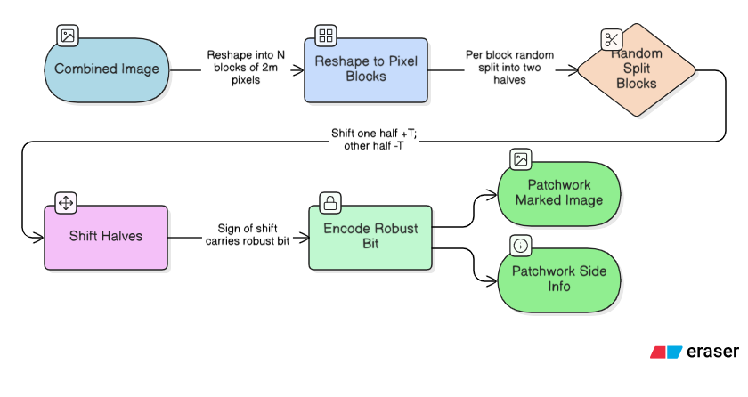
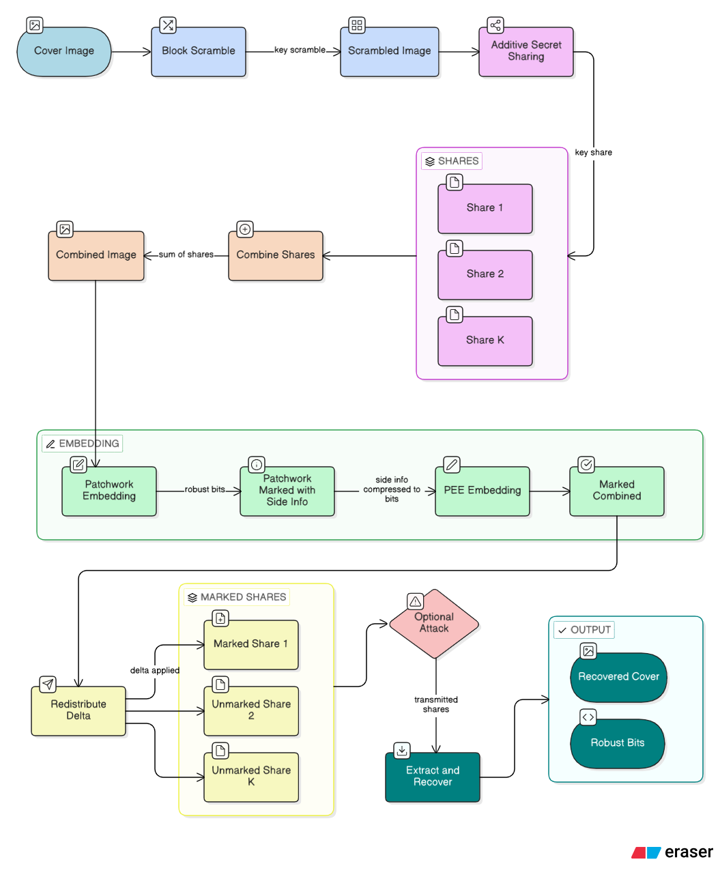

# RRWEI-SM Architecture

How a single image travels through the system — from the raw cover PNG
on disk to a marked, watermarked, optionally-encrypted image and back.
Every step lists (a) the module doing the work, (b) the data shape and
dtype, (c) the math from the paper it realises, and (d) the invariants
that must hold before the next step runs.

The codebase ships **two** end-to-end schemes that share most of the
pipeline:

- **Basic RRWEI-SM** — encrypt → SMC-embed → extract → decrypt.
- **Modified RRWEI-SM** — encrypt → *patchwork* embed → *PEE* embed side-info → extract → decrypt. (Two-stage, robust + reversible.)

Both operate on 8-bit grayscale images whose dimensions are multiples
of the scrambling block size (default 2).

---

## 0. Data model: what an "image" is at each stage

```
           disk          memory                    runtime form
cover  :  PNG/JPG  →  uint8 (H, W)            grayscale 8-bit
scrambled:           uint8 (H, W)             same after block permutation
share  :             int32  (H, W)            signed, can be large/negative
combined:            int64  (H, W)            = sum(shares)
HSB/LSB:             int64  (H, W) pair       HSB = combined >> n_lsb
marked :             int32  (H, W)            shares, perturbed by PEE+patchwork
recovered:           uint8 (H, W)             = cover, pixel-exact
```

`n_lsb` defaults to 3 → HSB carries the top 5 bits, LSB carries the
bottom 3.

---

## 1. Input: reading a cover image

**Where:** `demo.py`, `evaluate.py`, or user code.

```python
from PIL import Image
import numpy as np
cover = np.array(Image.open("lena.png").convert("L"), dtype=np.uint8)
# shape: (H, W), dtype uint8, values in [0, 255]
```

**Preconditions:**
- `cover.ndim == 2` (grayscale).
- `H % block_size == 0` and `W % block_size == 0` (default 2).
- Synthetic stand-ins used in tests are produced by `datasets/__init__.py`
  (`lena_like`, `baboon_like`, `peppers_like`).

Invariant leaving this step: a `uint8` H×W array whose entropy source
is the real image content.

---

## 2. Encryption phase

Encrypt = `scramble` → `additive_share`.

### 2a. Block-level scrambling

**Where:** `rrwei_sm/scrambling.py` (`scrambler="random"`, default) or
`rrwei_sm/hua_scrambling.py` (`scrambler="hua"`, 2D Logistic-Sine
Coupling Map, Hua et al. 2018).



- The image is reshaped to `(H/2, W/2, 2, 2)`, giving `H*W/4` blocks.
- A pseudo-random permutation of block indices is generated from
  `key_scramble`.
- **PEE blocks remain intact** — the 2×2 PEE predictor still gets a
  well-formed `(top-left, top-right, bottom-left, bottom-right)` quad.
- `block_unscramble` applies the inverse permutation with the same
  key.

Why: prevents an adversary who steals a single share from correlating
positions with the plaintext. The scramble key is part of the
`EncryptionKeys` bundle.

### 2b. Additive secret sharing

**Where:** `rrwei_sm/secret_sharing.py`.



The pipeline:

1. Split each pixel into HSB (top `8 − n_lsb` bits) and LSB (bottom
   `n_lsb` bits):
   `hsb = x >> n_lsb`, `lsb = x & (2**n_lsb − 1)`.
2. Share the LSBs **modulo `2**n_lsb`** — every share's LSB part is in
   `[0, 2**n_lsb)`.
3. Share the HSBs plus the carry that the modular LSB split implies.
4. Reassemble each share from its HSB/LSB parts; output is `int32`
   (not `uint8`) because individual shares are intentionally allowed
   to exceed `[0, 255]` — that is what makes them uniform-looking.

**Guaranteed invariants:**
- `share_1 + share_2 + … + share_k == scrambled` (exactly, in int64).
- `(share_1 >> n_lsb) + (share_2 >> n_lsb) + carry == scrambled_HSB`
  with `carry ∈ {0, −1}` per pixel, cancellable in the SMC protocol.
- Any single share, viewed on its own, is statistically indistinguishable
  from uniform noise (share/cover correlation ≈ 0.003 in practice).

Leaves the phase: `k` share tensors (int32) plus `EncryptionKeys`.

---

## 3. Embedding phase

Two very different flows. They share the PEE primitive but differ in
what bits they embed.

### 3A. Basic RRWEI-SM — SMC-backed PEE only

**Where:** `rrwei_sm/rrwei_sm.py::RRWEISM.embed` / `embed_k`.

**Input:** `shares` (from §2b) + bit-string `bits` (np.ndarray of 0/1).

**Step:**

1. Compute `combined = sum(shares)` in int64 (done at the
   coordinator; in a real SMC deployment this step is simulated by
   each party contributing a scaled prediction-error partial sum — see
   `_verify_smc_contribution`).
2. Run `PEEEmbedder.embed(combined, bits)` (`rrwei_sm/pee.py`):
   - For each non-overlapping 2×2 block, compute the **scaled
     prediction error** `e = 3·HSB[top-left] − (HSB[TR] + HSB[BL] + HSB[BR])`.
   - Find the mode `M_E` of the histogram of `e`.
   - For each bit `w`:
     - If `e == M_E`: embed by setting `e' = e + 3·w` (this shifts the
       target pixel by `2**n_lsb` in pixel space).
     - If `e > M_E`: shift by `+3` (i.e. `+2**n_lsb` in pixel space).
     - Else: leave unchanged.
   - Skip blocks that would overflow/underflow on shift; record the
     skip mask in `PEESideInfo`.
   - Repeat for up to `max_layers` layers until all `bits` are
     embedded.
3. Compute `delta = marked_combined − combined` and **add it to just one
   share** (the "watermark owner"'s share). All other shares are
   unchanged. This is what makes the protocol secret-multiparty:
   nobody else needs to see the plaintext.

**Leaves the phase:** marked shares (int32, one of them perturbed) plus
`EmbeddingSideInfo` (contains `PEESideInfo` + `n_embedded`).

### 3B. Modified RRWEI-SM — two-stage robust + reversible

**Where:** `rrwei_sm/modified_rrwei_sm.py::ModifiedRRWEISM.embed` /
`embed_k`.

The image is modified twice, so two fully reversible stages happen in
sequence:

**Stage 1 — Patchwork (robust watermark)**  `rrwei_sm/patchwork.py`



- `m` = patchwork half-size (default 4 → 8-pixel blocks).
- `T` = perturbation amount. When `patchwork_plane == "hsb"`, `T` is
  scaled to `T * 2**n_lsb` in pixel space so that shifts live entirely
  in the HSB plane (matches the paper).
- Blocks where the shift would cause overflow are **skipped**; their
  indices are stored in `skipped` mask → public metadata.
- Original per-block mean differences `d_i` are stored so stage-2 can
  perfectly undo stage-1 later.

**Stage 2 — PEE of the side info**

The `PatchworkSideInfo` is serialised into a compact bit payload:
`[flag bit][header][differences int16][skipped bitmap]`, optionally
**zlib-compressed** (`compress_side_info=True`). That bitstream is
then embedded via the exact same `PEEEmbedder` used in Basic RRWEI-SM.

**Leaves the phase:** fully marked shares + `ModifiedSideInfo` =
`(PatchworkSkeleton, PEESideInfo, compressed flag)`. The skeleton is
tiny (a few numbers + the skipped mask) and is the only thing the
receiver must carry alongside the image.

---

## 4. Transport / adversary (optional)

Between embedding and extraction the marked image may be attacked.
All implemented attacks live in `rrwei_sm/attacks.py`:

| Function | What it does |
|---|---|
| `additive_gaussian_noise(sigma)` | AWGN on pixel values |
| `salt_and_pepper_noise(p)` | Flip pixels to 0/255 with prob `p` |
| `median_filter(ksize)` | Non-linear smoothing |
| `mean_filter(ksize)` | Linear smoothing |
| `sharpen_filter(amount)` | Laplacian enhancement |
| `jpeg_compress(q)` | Lossy via Pillow JPEG |
| `jpeg2000_compress(layers)` | Lossy via Pillow OpenJPEG |

The attacked image is still an H×W uint8 array; it re-enters the
extraction phase in place of the pristine combined image.

---

## 5. Extraction & recovery

Two entry points — they are mathematically **separable** (either order
works) because scrambling is a block-level permutation that commutes
with the PEE 2×2 block operations.

### 5a. Basic RRWEI-SM

`RRWEISM.extract_before_decrypt(shares, side)` — works in the
encrypted domain:

```
marked shares → combined = Σ shares (int64, still scrambled)
             → PEEExtractor.extract(combined, pee_side)
             → (scrambled_cover_recovered, bits)
             → redistribute Δ back into one share
```

`RRWEISM.extract_after_decrypt(shares, keys, side)` — first inverts
PEE (in the scrambled domain), then unscrambles:

```
marked shares → combined
             → PEEExtractor.extract → scrambled cover + bits
             → unscramble(key_scramble) → plaintext cover (uint8)
```

Either way the output is:
- `recovered_cover` — pixel-exact uint8 equal to the input cover on
  intact images (BER of the cover = 0, PSNR = ∞).
- `bits` — the first `n_embedded` entries match the input bitstring
  exactly (BER = 0).

### 5b. Modified RRWEI-SM

Two sub-paths:

**Quick robust path** — `extract_robust_after_decrypt(...)`
Inverts patchwork only (no PEE inversion).

```
combined (possibly attacked)
    → reshape into patchwork blocks
    → measure per-block mean difference
    → compare to +/- T·threshold (with skipped_mask)
    → robust bits (BER measured against embedded bits)
```

This is the path that survives Gaussian/JPEG/etc.; BER stays low
(0.000 under σ=10 on smooth images in our tests).

**Full inversion path** — `extract_and_recover_after_decrypt(...)`

```
combined (intact)
    → PEEExtractor.extract         (undo stage 2)
    → decode payload (possibly unzip, then bits-to-bytes)
    → reconstruct PatchworkSideInfo
    → PatchworkExtractor.extract   (undo stage 1 with stored d_i)
    → unscramble(key_scramble)
    → (recovered_cover uint8, robust_bits)
```

Reversibility invariant: `recovered_cover == cover` byte-for-byte.

---

## 6. Output: what the user sees

For a successful end-to-end run on an intact marked image:

| Output | Type | Guarantee |
|---|---|---|
| `recovered_cover` | uint8 (H, W) | Equals input cover exactly |
| `robust_bits` | uint8 (N,), values ∈ {0,1} | Equals input bits exactly |
| `PSNR(cover, marked)` | float | ≥ 30 dB (paper target), 32-40 dB in our runs |
| `SSIM(cover, marked)` | float | ≥ 0.97 on all three classic images |
| `BER(bits, recovered_bits)` | float | 0.000 on intact image; ≤ 0.1 under mild attacks |

Under attacks, the quick robust path still returns plausible bits;
exact cover recovery is intentionally lost because PEE is not
invertible on corrupted data.

---

## 7. Pipeline diagram (Modified RRWEI-SM, happy path)



---

## 8. Where the code lives (one-page map)

| Layer | Module | Paper reference |
|---|---|---|
| I/O, datasets | `datasets/__init__.py`, `demo.py`, `evaluate.py` | Fig. 9, §V |
| Scrambling (random) | `rrwei_sm/scrambling.py` | §IV-B-1 |
| Scrambling (Hua) | `rrwei_sm/hua_scrambling.py` | Ref [38] |
| Additive sharing | `rrwei_sm/secret_sharing.py` | Eqs. 7-14 |
| PEE primitives | `rrwei_sm/pee.py` | Eqs. 15-22 |
| Patchwork primitives | `rrwei_sm/patchwork.py` | Eqs. 23-27 |
| Basic orchestrator | `rrwei_sm/rrwei_sm.py` | §IV-B |
| Two-stage orchestrator | `rrwei_sm/modified_rrwei_sm.py` | §IV-C |
| Attack suite | `rrwei_sm/attacks.py` | §V-C |
| Metrics | `rrwei_sm/utils.py`, `rrwei_sm/metrics.py` | §V-A, Eq. 28 |
| Benchmarks | `benchmark.py` | Table VII |
| Figures | `figures/make_*.py` | Figs. 11-19 |
| Tests | `tests/` (96 tests) | — |

All invariants of sections 2-5 above are enforced by the unit tests;
the embedding self-check in `RRWEISM.embed` asserts the SMC
contribution formula at runtime. If any shape, dtype, or arithmetic
invariant is broken, the pipeline will fail fast rather than produce
silently-wrong watermarks.
