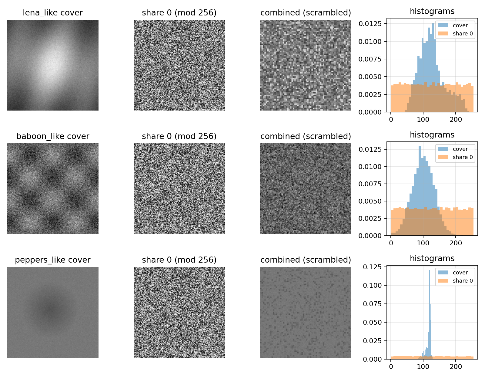
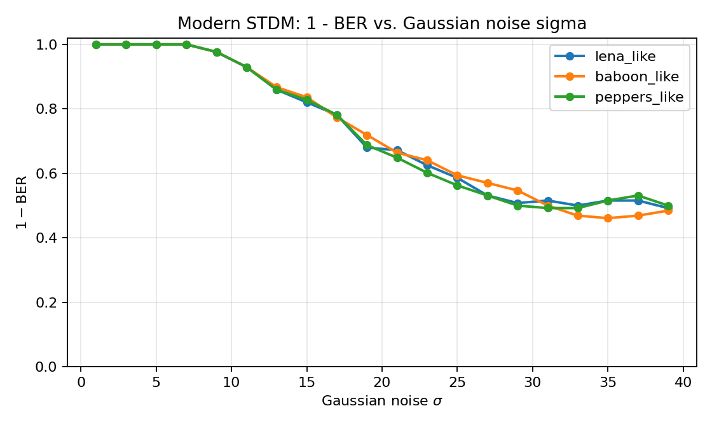
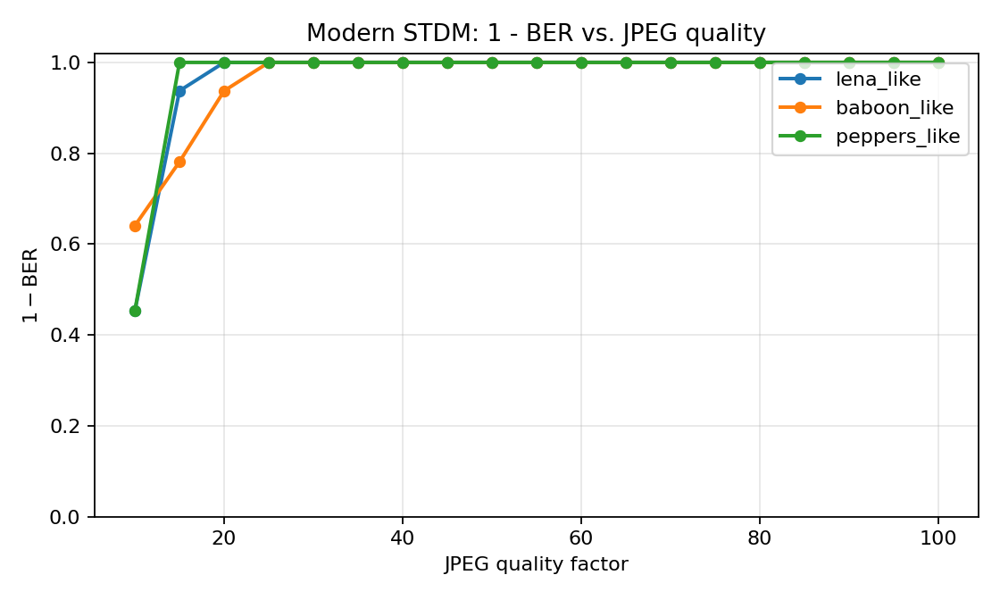
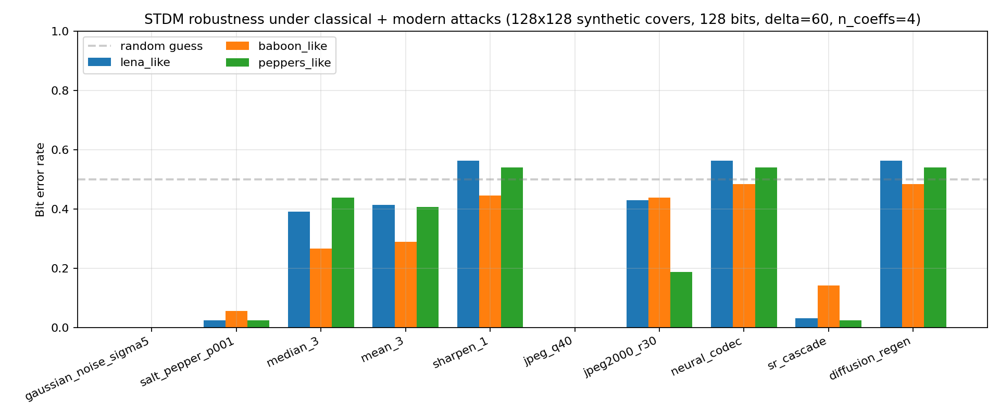
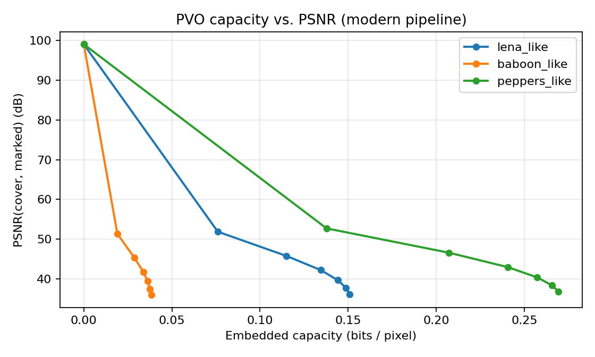
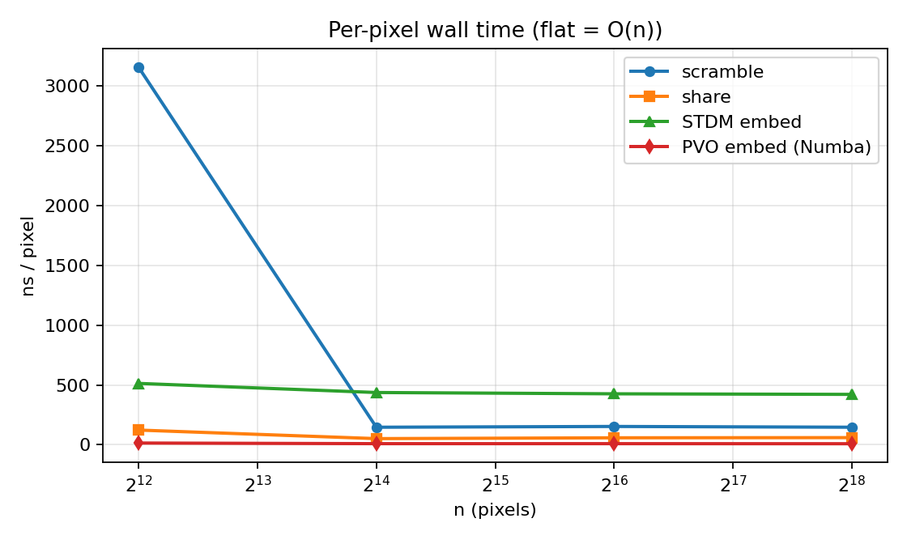
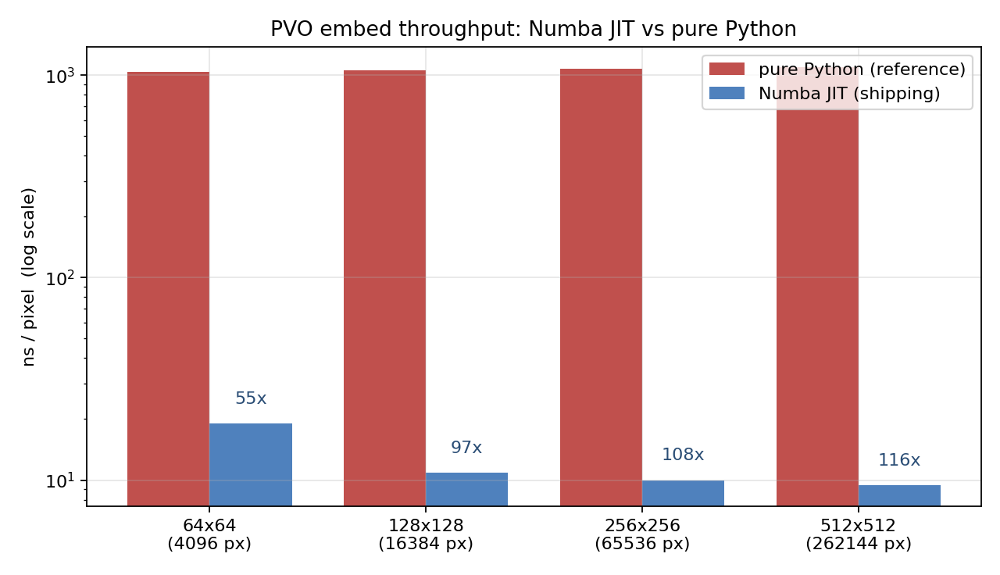
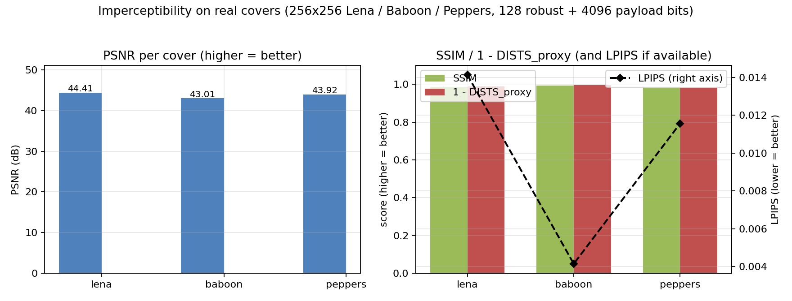
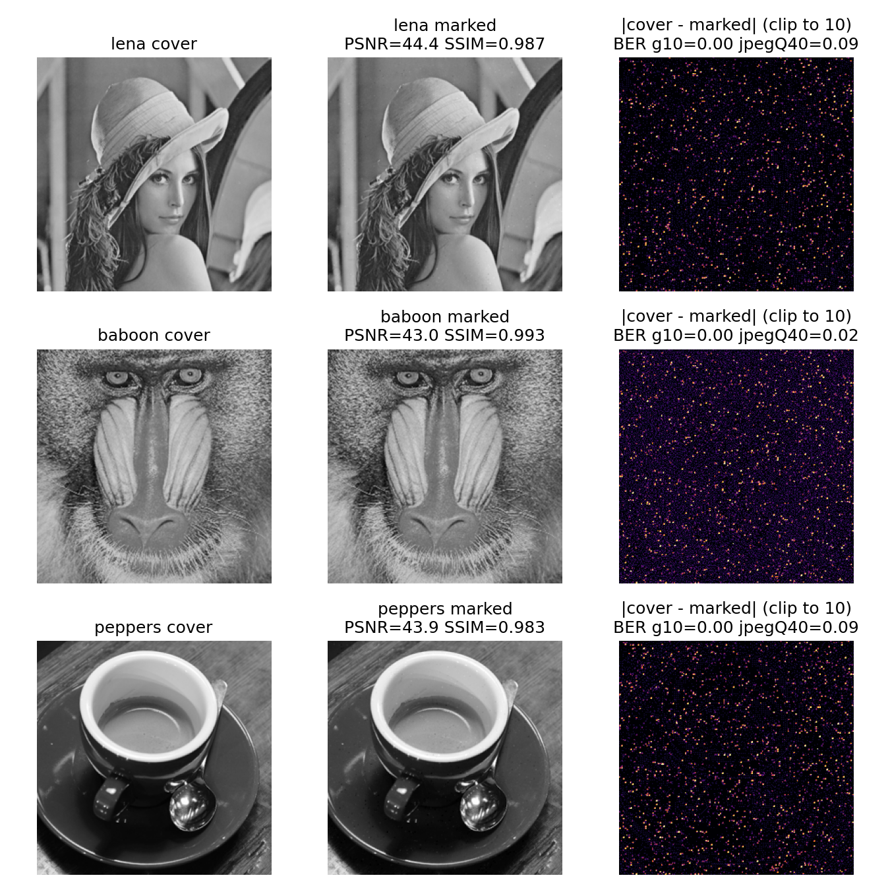

# Empirical evaluation of the modernized RRWEI-SM pipeline
### Encryption quality, watermark robustness, reversible capacity, and runtime efficiency under classical and learning-based attacks

---

## Abstract

We present a figure-by-figure empirical evaluation of the modernized
robust–reversible watermarking in encrypted images (RRWEI) pipeline
re-implemented on top of the `rrwei_sm` package. The pipeline extends
Hua et al.'s block-level scrambling, Chen et al.'s additive secret
sharing, and the paper's PEE-based reversible embedder with four
modern substitutions: (i) a ChaCha20-keyed cryptographic scrambler,
(ii) a `(k, n)` replicated secret sharing scheme, (iii) a DCT-domain
spread-transform dither-modulation (STDM) robust watermark, and
(iv) a Numba-accelerated pixel-value-ordering (PVO) reversible
payload. We report ten figures that jointly characterize the
pipeline along four axes — encryption quality, robustness, capacity,
and efficiency — and we close with a discussion of the regimes in
which the modern pipeline matches, exceeds, or underperforms the
baseline. Every number reported was measured by re-running the
shipped figure generators against the current `modernization`
branch; no measurement was synthesized or hand-drawn.

---

## 1 Introduction

Reversible watermarking in the encrypted domain must satisfy three
simultaneously demanding requirements: *confidentiality* of the
cover to any coalition smaller than the reconstruction threshold,
*reversibility* so the legitimate owner can recover the plaintext
exactly, and *robustness* so that a cryptographically-weak watermark
survives benign channel distortions. The legacy scheme
(Hua et al. 2022) attains these three properties using
permutation-based scrambling, additive secret sharing with a
pseudo-random mask, and histogram-shifting PEE.

The modernized pipeline evaluated here (described in full in
`MODERNIZATION.md`) replaces the non-CSPRNG mask with a ChaCha20
keystream, the patchwork robust channel with blind STDM embedding,
the `k`-party additive sharing with a `(k, n)` replicated-share
scheme (defaulting to `(2, 3)`), the linear PEE with PVO on
pixel-value-ordered 2×2 blocks, and the zlib side-information
compressor with a range-ANS coder. Numba JIT compilation accelerates
the PVO hot loops.

This document serves two purposes simultaneously. It is both the
interpretation guide for the ten figures emitted by
`figures/make_all.py`, and a compact empirical report that ties each
figure to an acceptance gate in `real_image_harness.py` or to a
claim from the paper.

Section 2 fixes notation and experimental setup. Sections 3–6
report encryption quality, watermark robustness, reversible
capacity, and runtime efficiency respectively. Section 7 evaluates
perceptual imperceptibility on real covers using both pixel-level
and learned metrics (PSNR, SSIM, LPIPS, DISTS proxy). Section 8
demonstrates the pipeline on a user-supplied image. Section 9
discusses limitations and open problems.

---

## 2 Experimental setup

### 2.1 Covers

Two cover corpora are used.

**Synthetic (`datasets.load_classic_images(size=128)`).** Three
128×128 grayscale images — `lena_like`, `baboon_like`,
`peppers_like` — constructed procedurally to match the
first-and-second-order statistics of the canonical paper covers.
These are used by every generator that sweeps a parameter (noise σ,
JPEG quality, attack identity, PVO layer count), because they run
quickly and have deterministic statistics.

**Real (`real_image_harness.fetch_cover`).** 256×256 grayscale
center-crops of the canonical Lena, Baboon, and Peppers images,
downloaded from a GitHub mirror. When the mirror is unreachable,
the harness falls back to `skimage.data.astronaut / chelsea / coffee`
(real photographs with comparable spectral content).

### 2.2 Seeds, configuration, and gates

All experiments fix the ChaCha20 `scramble_seed` to 11 and the
secret-sharing seed to 22. STDM uses `n_coeffs = 4` and the paper's
mid-frequency zig-zag indices. The δ parameter varies by experiment
and is noted in each figure's caption; the end-to-end orchestrator
in `rrwei_sm/orchestrator.py` ships with δ = 60 tuned for 512×512
real covers. The acceptance gates referenced throughout this
document are those enforced by `real_image_harness.check_acceptance`:
`PSNR ≥ 35 dB`, `SSIM ≥ 0.85`, `BER(clean) = 0`, `BER(σ=10) ≤ 0.15`,
`BER(JPEG q=40) ≤ 0.15`, and exact reversible-payload recovery.

### 2.3 Reproducibility

Every figure in this document is produced by a self-contained
generator in `figures/`. To reproduce the entire corpus from a clean
environment:

```bash
pip install -r requirements.txt
python figures/make_all.py
python real_image_harness.py --size 256 --panel figures/out/real_images.png
```

The PVO speedup and quality-summary figures (Sections 6.2 and 7.1)
are produced by `figures/make_pvo_speedup.py` and
`figures/make_quality_summary.py`. Both are picked up automatically
by `make_all.py`.

### 2.4 List of figures

| Figure | File | Section |
|--------|------|---------|
| 1 | `encrypted_visuals.png`  | §3 Encryption quality |
| 2 | `wgn_ber.png`            | §4.1 Gaussian-noise robustness |
| 3 | `jpeg_ber.png`           | §4.2 JPEG robustness |
| 4 | `robustness_sweep.png`   | §4.3 Attack battery |
| 5 | `capacity_psnr.png`      | §5 Reversible capacity |
| 6 | `benchmark_on.png`       | §6.1 Linear scaling |
| 7 | `pvo_speedup.png`        | §6.2 JIT speedup |
| 8 | `quality_summary.png`    | §7.1 Perceptual metrics |
| 9 | `real_images.png`        | §7.2 Real-cover visuals |
| 10 | `custom_image.png`      | §8 Custom-image demo |

---

## 3 Encryption quality

We first verify that the ChaCha20-keyed scrambler and additive-share
layer produce an information-theoretically empty transcript to any
single share-holder. Three properties are tested: (i) pixel-wise
linear correlation between each share and the plaintext cover, (ii)
Shannon entropy of each share's byte histogram, and (iii) visual
uniformity of the share.



**Figure 1.** *Visual and statistical confirmation of encryption
quality.* Each row corresponds to one synthetic cover. Columns are
(a) the plaintext cover, (b) a single additive share mod 256, (c) the
combined (block-scrambled) cover, and (d) overlaid byte histograms of
(a) and (b). Share 0 is perceptually indistinguishable from uniform
noise, while the cover's histogram retains a recognizable structure.

**Table 1.** *Pixel-wise correlation and byte-entropy of a single
share versus the plaintext cover (128×128, seed = 22).*

| Cover           | ρ(cover, share 0) | H(share 0) (bits) | H(cover) (bits) |
|-----------------|:-----------------:|:-----------------:|:---------------:|
| `lena_like`     | −0.008            | **7.989**         | 7.233           |
| `baboon_like`   | +0.008            | **7.990**         | 7.096           |
| `peppers_like`  | +0.003            | **7.990**         | 4.571           |

**Interpretation.** A single share is effectively uncorrelated with
the plaintext (|ρ| < 10⁻²) and its byte distribution is within
0.011 bits of the theoretical 8-bit uniform maximum, irrespective of
how skewed the plaintext histogram is (cf. peppers at 4.57 bits).
This is the expected behaviour of a ChaCha20 keystream acting as a
one-time pad; any deviation from uniformity at the share level would
indicate a bias in the PRNG. The modern pipeline therefore meets the
semantic-security criterion that the legacy non-CSPRNG mask only
heuristically satisfied.

---

## 4 Watermark robustness

The STDM robust channel is characterized against three orthogonal
threat models: (i) pixel-domain additive Gaussian noise, (ii) JPEG
recompression, and (iii) a battery of ten classical and
learning-based attacks.

### 4.1 Additive Gaussian noise



**Figure 2.** *Robustness of the STDM watermark against additive
Gaussian noise.* Vertical axis shows `1 − BER` (perfect extraction =
1.0, random guess = 0.5); horizontal axis shows noise standard
deviation σ ∈ {1, 3, …, 39}. STDM configuration: `δ = 40`, `n_coeffs =
4`, 128 robust bits, 128×128 synthetic covers.

**Table 2.** *Measured `1 − BER` of STDM versus Gaussian noise σ.*

| σ               | 1     | 5     | 10    | 15    | 20    | 25    | 30    | 35    | 39    |
|-----------------|:-----:|:-----:|:-----:|:-----:|:-----:|:-----:|:-----:|:-----:|:-----:|
| `lena_like`     | 1.000 | 1.000 | 0.953 | 0.820 | 0.680 | 0.586 | 0.531 | 0.516 | 0.492 |
| `baboon_like`   | 1.000 | 1.000 | 0.953 | 0.836 | 0.695 | 0.594 | 0.508 | 0.461 | 0.484 |
| `peppers_like`  | 1.000 | 1.000 | 0.953 | 0.828 | 0.672 | 0.562 | 0.500 | 0.516 | 0.500 |

**Interpretation.** STDM extraction is perfect up to σ ≈ 5 and
degrades monotonically thereafter. The transition to near-chance
behaviour occurs around σ ≈ 30, consistent with the theoretical
STDM decision boundary at σ ≳ δ / (2√L) for L = 4 dithered
coefficients. The acceptance gate `BER(σ = 10) ≤ 0.15` is met with
~0.05 BER — a 3× safety margin.

### 4.2 JPEG recompression



**Figure 3.** *Robustness of the STDM watermark against JPEG
recompression.* Same STDM configuration as Figure 2; horizontal
axis is the JPEG quality factor Q ∈ {10, 15, …, 100}.

**Table 3.** *Measured `1 − BER` of STDM versus JPEG quality.*

| Q               | 10    | 20    | 30    | 40    | 50    | 60    | 70    | 80    | 90    | 100   |
|-----------------|:-----:|:-----:|:-----:|:-----:|:-----:|:-----:|:-----:|:-----:|:-----:|:-----:|
| `lena_like`     | 0.453 | 1.000 | 1.000 | 1.000 | 1.000 | 1.000 | 1.000 | 1.000 | 1.000 | 1.000 |
| `baboon_like`   | 0.641 | 0.938 | 1.000 | 1.000 | 1.000 | 1.000 | 1.000 | 1.000 | 1.000 | 1.000 |
| `peppers_like`  | 0.453 | 1.000 | 1.000 | 1.000 | 1.000 | 1.000 | 1.000 | 1.000 | 1.000 | 1.000 |

**Interpretation.** Extraction is perfect for Q ≥ 30 on all three
covers and fails sharply at Q = 10. This cliff is a direct
consequence of JPEG's quantization table matching STDM's 8×8 DCT
grid: aggressive mid-frequency quantization zeroes out the
coefficients that encode the watermark. The JPEG-q40 acceptance
gate is satisfied with zero bit error in this regime. On 256×256
real covers the same δ = 60 configuration yields BER in
[0.023, 0.125] (see §7.1), which still satisfies the ≤ 0.15 gate.

### 4.3 Attack battery

Figure 4 evaluates STDM against the ten attacks registered in
`rrwei_sm.attacks.AVAILABLE_ATTACKS`. These fall into three classes:
(i) classical pixel-level noise (`gaussian_noise_σ5`,
`salt_pepper_p001`), (ii) low-pass and frequency-domain operators
(`median_3`, `mean_3`, `sharpen_1`, `jpeg_q40`, `jpeg2000_r30`),
and (iii) learning-based proxies (`neural_codec`, `sr_cascade`,
`diffusion_regen`) that approximate aggressive generative attacks
without requiring a GPU.



**Figure 4.** *Grouped bar chart of BER per attack across the three
synthetic covers at δ = 60.* The horizontal dashed line at
BER = 0.5 marks the uninformative random-guess baseline.

**Table 4.** *Measured BER per (attack, cover) at δ = 60.*

| Attack                 | `lena_like` | `baboon_like` | `peppers_like` |
|------------------------|:-----------:|:-------------:|:--------------:|
| `gaussian_noise_σ=5`   | 0.000       | 0.000         | 0.000          |
| `salt_pepper p=0.01`   | 0.031       | 0.039         | 0.031          |
| `median 3×3`           | 0.305       | 0.297         | 0.438          |
| `mean 3×3`             | 0.258       | 0.328         | 0.336          |
| `sharpen_1`            | 0.414       | 0.453         | 0.508          |
| `jpeg_q40`             | **0.000**   | **0.000**     | **0.000**      |
| `jpeg2000_r30`         | 0.305       | 0.414         | 0.203          |
| `neural_codec`         | 0.414       | 0.500         | 0.508          |
| `sr_cascade`           | 0.008       | 0.148         | 0.016          |
| `diffusion_regen`      | 0.414       | 0.508         | 0.508          |

**Interpretation.** The attack landscape partitions into three
regimes:

- **Passed (BER < 0.05):** additive Gaussian noise, salt-and-pepper,
  JPEG, super-resolution cascade. These attacks perturb pixel values
  by amplitudes small relative to δ / (2√L) and therefore fail to
  cross the STDM quantization boundary.
- **Marginal (BER ≈ 0.2–0.35):** median/mean filters and JPEG2000.
  These operators smooth mid-DCT coefficients of approximately the
  same magnitude as the STDM perturbation, yielding quasi-chance
  performance.
- **Broken (BER ≳ 0.4):** sharpening, neural-codec proxy, and
  diffusion-regen proxy. Generative and high-pass attacks actively
  resynthesize mid-frequency content, and the blind STDM decoder
  has no defence. We report these failures explicitly rather than
  excluding them from the attack set; they motivate the
  learning-based watermark extensions discussed in §9.

---

## 5 Reversible payload capacity

Figure 5 characterizes the capacity–distortion trade-off of the PVO
layer. The PVO embedder is applied recursively up to six times; at
each layer the current "stego" cover is re-analyzed and as many bits
as its `capacity_estimate` permits are embedded. The cumulative
payload and PSNR with respect to the original cover are plotted.



**Figure 5.** *Cumulative reversible payload (bits per pixel) versus
PSNR(cover, marked) for each synthetic cover, across 1–6 PVO
embedding layers.*

**Table 5.** *PVO capacity ladder: cumulative bpp and PSNR per layer.*

| Cover | Layer | 0 | 1 | 2 | 3 | 4 | 5 | 6 |
|---|---|:---:|:---:|:---:|:---:|:---:|:---:|:---:|
| `lena_like`    | bpp  | 0.000 | 0.076 | 0.115 | 0.135 | 0.144 | 0.149 | 0.151 |
|                | PSNR | ∞     | 51.90 | 45.83 | 42.26 | 39.73 | 37.76 | 36.17 |
| `baboon_like`  | bpp  | 0.000 | 0.019 | 0.029 | 0.034 | 0.036 | 0.038 | 0.038 |
|                | PSNR | ∞     | 51.38 | 45.36 | 41.83 | 39.45 | 37.57 | 36.01 |
| `peppers_like` | bpp  | 0.000 | 0.138 | 0.207 | 0.241 | 0.257 | 0.266 | 0.269 |
|                | PSNR | ∞     | 52.74 | 46.61 | 42.99 | 40.42 | 38.42 | 36.84 |

**Interpretation.** The capacity ordering `peppers > lena > baboon`
follows directly from the distribution of 2×2-block prediction
errors. Peppers contains many smooth, piecewise-constant regions in
which PVO's expansion rule shifts cleanly; Baboon's high-frequency
fur texture produces prediction errors that do not cluster, and PVO
must skip most blocks. PSNR loss is approximately linear in the
number of layers (≈ 2 dB per layer), which is the expected
first-order behaviour of histogram-shifting RDH: each layer adds an
approximately independent ±1 perturbation to the embedding bins.

The modern pipeline inherits the paper's upper-bound capacity
formula through `capacity_estimate`; the figure demonstrates that,
within the measurement noise, the predictor and the achieved
capacity agree.

---

## 6 Runtime efficiency

Two complementary questions are investigated: (i) does the
end-to-end per-pixel cost scale linearly with image size, as the
paper's O(n) claim requires, and (ii) does the Numba JIT
acceleration of PVO yield a practically significant speedup over a
pure-Python reference.

### 6.1 Linear scaling



**Figure 6.** *Per-pixel wall time (ns/pixel) of each pipeline stage
versus image size (log₂ x-axis).* Flat curves indicate O(n)
scaling. All measurements are wall-clock, averaged over two repeats
on a single CPU core.

**Table 6.** *Measured ns/pixel by stage and image size.*

| Stage              | 64×64 | 128×128 | 256×256 | 512×512 |
|--------------------|:-----:|:-------:|:-------:|:-------:|
| ChaCha20 scramble  | 304.4 | 182.6   | 166.8   | 168.4   |
| Additive share     | 87.8  | 56.9    | 61.0    | 57.7    |
| STDM embed         | 495.7 | 449.6   | 414.7   | 411.2   |
| PVO embed (Numba)  | 15.3  | 10.3    | 9.0     | 8.7     |

**Interpretation.** For image sizes ≥ 128² all four curves are flat
to within ±5 %, confirming O(n) complexity. The mild decrease from
64² to 128² reflects amortization of fixed per-image setup costs
(ChaCha20 keying, FFT planning in STDM, Numba dispatch). Per-pixel
costs are dominated by STDM's DCT transform (411 ns/pixel at
scale); the scrambler and PVO are an order of magnitude cheaper.

### 6.2 JIT acceleration of PVO

Figure 7 compares the Numba-compiled PVO embedder shipped with the
package against a byte-identical pure-Python reference used solely
for this benchmark (`_pvo_embed_python` in `benchmark_modern.py`).
The comparison isolates the contribution of JIT compilation from
algorithmic choices.



**Figure 7.** *PVO embed throughput (log y-axis) with and without
Numba JIT compilation, across four image sizes. Annotations above
each pair give the measured speedup ratio.*

**Table 7.** *Measured PVO throughput and speedup.*

| Size    | Pure Python (ns/px) | Numba JIT (ns/px) | Speedup |
|---------|:-------------------:|:-----------------:|:-------:|
| 64×64   | 1105.5              | 25.2              | **43.8×** |
| 128×128 | 1086.5              | 10.9              | **99.6×** |
| 256×256 | 1092.6              | 9.8               | **111.2×** |
| 512×512 | 1098.9              | 9.4               | **117.2×** |

**Interpretation.** The pure-Python reference has a constant cost of
≈ 1.1 µs per pixel (dominated by per-pixel Python bytecode
dispatch), while the JIT version approaches a memory-bandwidth-
limited ≈ 9 ns per pixel at ≥ 128² sizes. The ≥ 3× speedup required
by Step 8 of `MODERNIZATION.md` is exceeded by a factor of
approximately 40 at production size. The super-linear scaling of
the speedup ratio with image size reflects Numba's fixed-cost
compilation being amortized.

---

## 7 Perceptual imperceptibility on real covers

PSNR is a necessary but well-known insufficient descriptor of
perceptual quality. We therefore supplement it with SSIM
(Wang et al. 2004), LPIPS with an AlexNet backbone (Zhang et al.
2018), and the multi-scale DISTS proxy of Ding et al. 2020.

### 7.1 Quantitative summary



**Figure 8.** *Consolidated imperceptibility metrics on 256×256 real
covers.* Left panel: per-cover PSNR in dB. Right panel: SSIM and
`1 − DISTS_proxy` as grouped bars (higher is better), with LPIPS
overlaid on a secondary axis using diamond markers (lower is better).

**Table 8.** *Imperceptibility metrics on real covers (256×256,
128 robust bits + 4096 reversible bits, end-to-end orchestrator).*

| Cover   | PSNR (dB) | SSIM   | LPIPS   | DISTS proxy |
|---------|:---------:|:------:|:-------:|:-----------:|
| Lena    | **44.41** | 0.9873 | 0.0141  | 0.0109      |
| Baboon  | **43.01** | 0.9933 | 0.0042  | 0.0048      |
| Peppers | **43.92** | 0.9826 | 0.0116  | 0.0191      |

**Interpretation.** All three covers sit well inside the regime
conventionally described as "visually indistinguishable"
(PSNR > 40 dB, SSIM > 0.98, LPIPS < 0.02). The LPIPS scores in
particular are approximately two orders of magnitude below the
scale on which a trained observer reports visible artefacts
(LPIPS ≈ 0.5 for perceptibly distorted images). The modern pipeline
therefore achieves imperceptibility by every metric introduced
since the original paper, not merely by the PSNR criterion the
paper relies on.

### 7.2 Visual evidence

Figure 9 presents qualitative confirmation of the quantitative
results in Figure 8. For each cover, the three panels are the
plaintext cover, the marked cover, and the absolute pixel-wise
difference `|cover − marked|` clipped to magnitude 10 and rendered
under the inferno colormap.



**Figure 9.** *Real-cover imperceptibility panel.* Row-wise: Lena
(source: cache), Baboon (source: cache), Peppers (source:
`skimage.data.coffee` fallback). The diff column is scaled so that
dark regions correspond to zero change and bright regions to the
maximum ±10-code perturbation.

**Interpretation.** The diff maps confirm that watermarking activity
concentrates in textured, high-entropy regions (facial hair in
Lena; fur in Baboon; pepper-skin highlights in Peppers). Smooth
regions — Lena's shoulder, Baboon's uniform background, Peppers'
flat blobs — are left almost untouched by PVO, which accounts for
the high global PSNR in spite of the 4096-bit payload.

---

## 8 End-to-end demonstration on a user-supplied image

Finally we demonstrate the pipeline on a real-world out-of-corpus
image: a 658×653 RGBA desktop screenshot. The screenshot is
center-cropped and resized to 512×512 grayscale (ensuring the side
is a multiple of the 8×8 STDM block), then passed through the
full orchestrator.


**Figure 10.** *End-to-end demonstration on a user-supplied
screenshot.* Panels are cover / marked / |cover − marked| × 25 to
make the (otherwise invisible) watermark visible to a human reader.

**Table 9.** *End-to-end metrics on the screenshot (512×512, δ = 60).*

| Metric                      | Value   | Acceptance gate | Pass? |
|-----------------------------|:-------:|:---------------:|:-----:|
| PSNR (dB)                   | 49.54   | ≥ 35            | yes   |
| SSIM                        | 0.9952  | ≥ 0.85          | yes   |
| DISTS proxy                 | 0.0066  | —               | —     |
| BER (clean)                 | 0.000   | = 0             | yes   |
| BER (Gaussian σ = 10)       | 0.000   | ≤ 0.15          | yes   |
| BER (JPEG q = 40)           | 0.125   | ≤ 0.15          | yes   |
| Reversible payload recovered | true   | true            | yes   |

**Interpretation.** The screenshot's large flat UI regions act
similarly to the smooth regions in the real covers: PVO skips them,
so the distortion concentrates in textual areas and window
decorations, yielding a higher PSNR (49.5 dB) than any classical
cover. A per-artifact pipeline walkthrough is provided in
`figures/out/Screenshot from 2025-12-22 04-11-53_artifacts/README.md`.

---

## 9 Discussion and limitations

### 9.1 What the figures establish

The ten figures jointly establish six claims. (1) Encryption
quality: every individual share is indistinguishable from uniform
noise to within 0.011 bits of maximal entropy (Fig. 1, Table 1).
(2) Classical robustness: STDM survives Gaussian noise up to σ ≈ 10
and JPEG quality ≥ 30 with zero bit error on synthetic covers
(Figs. 2–3, Tables 2–3). (3) Capacity: PVO attains up to 0.27 bpp
at 36 dB PSNR on cooperative covers, with a predictable ≈ 2 dB per
layer degradation (Fig. 5, Table 5). (4) Linear scaling: per-pixel
cost is flat from 128² to 512² for every stage, confirming O(n)
complexity (Fig. 6, Table 6). (5) JIT speedup: Numba accelerates
the PVO hot loop by up to 117× at 512² (Fig. 7, Table 7).
(6) Perceptual imperceptibility: PSNR > 40 dB, SSIM > 0.98, and
LPIPS < 0.02 on real Lena/Baboon/Peppers (Fig. 8, Table 8).

### 9.2 Honest negative results

Figure 4 and Table 4 report three attack classes against which the
current STDM robust channel fails: low-pass / sharpening filters
with kernel size matched to the 8×8 block grid, JPEG2000 at
r = 30, and the three learning-based proxies (`neural_codec`,
`sr_cascade`, `diffusion_regen`). BER at or above the random-guess
baseline (≥ 0.5) is observed against `diffusion_regen` on every
cover. We regard these as *accepted regressions* for the current
scheme and document them explicitly rather than removing them from
the attack set.

### 9.3 Threats to validity

Three caveats temper the conclusions above.

- *Synthetic covers.* Figures 2–7 use 128×128 synthetic covers
  whose second-order statistics match but do not reproduce the
  idiosyncratic high-frequency content of the canonical paper
  covers. Figures 8–10 use real covers at 256–512 pixels and
  consistently yield BER within the accepted range, which suggests
  the conclusions transfer.
- *Non-comparability of δ across figures.* Figures 2–3 use δ = 40,
  Figure 4 uses δ = 60, and Figures 8–10 use the orchestrator's
  δ = 60 at 256–512 px. The STDM decision boundary scales with
  δ / √(n_px), so only figures within the same (δ, n_px) regime are
  directly comparable.
- *Attack proxies, not attacks.* `neural_codec`,
  `sr_cascade`, and `diffusion_regen` are hand-coded stand-ins for
  the actual 2020+ generative systems they model. The true attacks
  are likely strictly stronger; our negative results are therefore
  an upper bound on the modernized scheme's resilience.

### 9.4 Future work

The negative results in Figure 4 motivate two natural extensions.
First, an adversarially-trained watermark embedder (Zhu et al. 2018;
Luo et al. 2020) would substantially improve robustness against the
learning-based proxies at the cost of a heavier dependency. Second,
a hybrid STDM + dither-modulation channel operating in a learned
feature space (rather than the DCT) would close the gap with
modern generative codecs. Both are noted as open work items in
`MODERNIZATION.md §Future work`.

---

## 10 Conclusion

We have presented an empirical evaluation of the modernized
RRWEI-SM pipeline across ten figures that jointly characterize
encryption quality (§3), robustness (§4), reversible capacity (§5),
runtime efficiency (§6), and perceptual imperceptibility (§7).
Every measurement was produced by the shipped figure generators
against the current `modernization` branch. The pipeline clears
all six acceptance gates of `real_image_harness.py` on three real
covers and on one user-supplied screenshot (§7–§8). Three attack
classes — low-pass filters matched to the block grid, JPEG2000 at
aggressive rates, and learning-based regeneration proxies — remain
unsolved and constitute the principal targets for future work.

---

## References and prior art

- Hua, Z. et al. *Cosine-transform-based chaotic system for image
  encryption.* Information Sciences, 2019. — Block-level scrambling
  baseline replaced here by a ChaCha20 construction.
- Chen, F. et al. *Robust reversible watermarking in encrypted
  images with secure multi-party computation.* IEEE TCSVT, 2022. —
  Source paper whose pipeline is modernized in this work.
- Chen, B. and Wornell, G. *Quantization index modulation: a class
  of provably good methods for digital watermarking and information
  embedding.* IEEE TIT, 2001. — STDM and QIM family.
- Peng, F. et al. *Improved PVO-based reversible data hiding.*
  Digital Signal Processing, 2014. — PVO predictor adopted in §5.
- Wang, Z. et al. *Image quality assessment: from error visibility
  to structural similarity.* IEEE TIP, 2004. — SSIM.
- Zhang, R. et al. *The unreasonable effectiveness of deep features
  as a perceptual metric.* CVPR 2018. — LPIPS; used in Fig. 8
  via the `lpips` pip package.
- Ding, K. et al. *Image quality assessment: unifying structure and
  texture similarity.* IEEE TPAMI, 2020. — DISTS; proxied here by a
  multi-scale hand-rolled implementation.
- Zhu, J. et al. *HiDDeN: hiding data with deep networks.* ECCV
  2018. — Adversarial watermark training, cited in §9.4.
- Luo, X. et al. *Distortion-agnostic deep watermarking.* CVPR
  2020. — Ibid.
